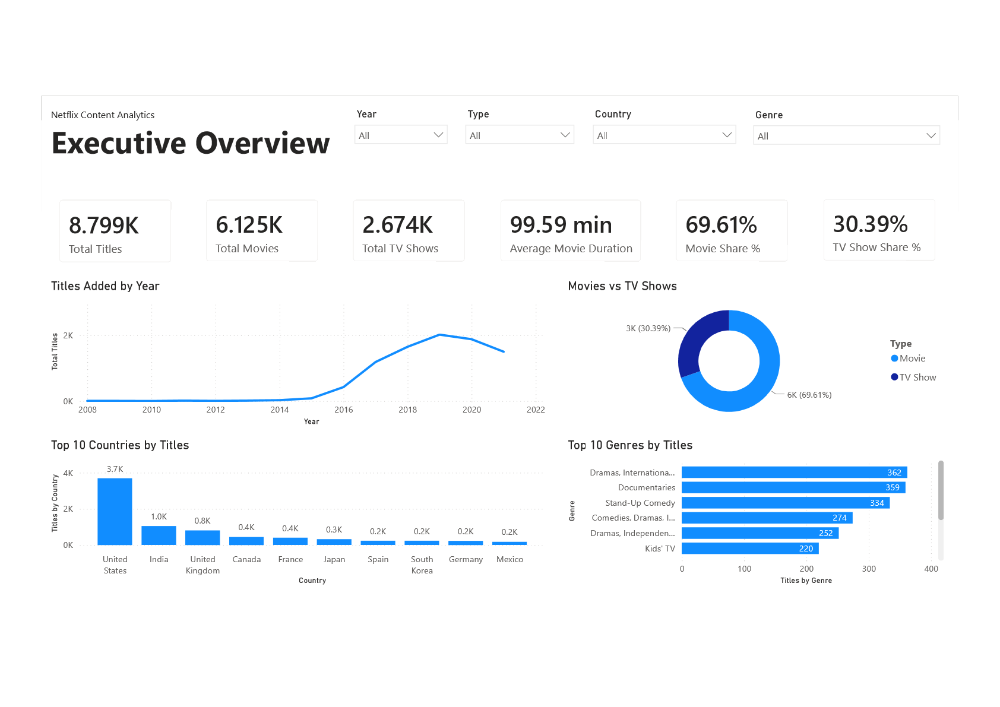
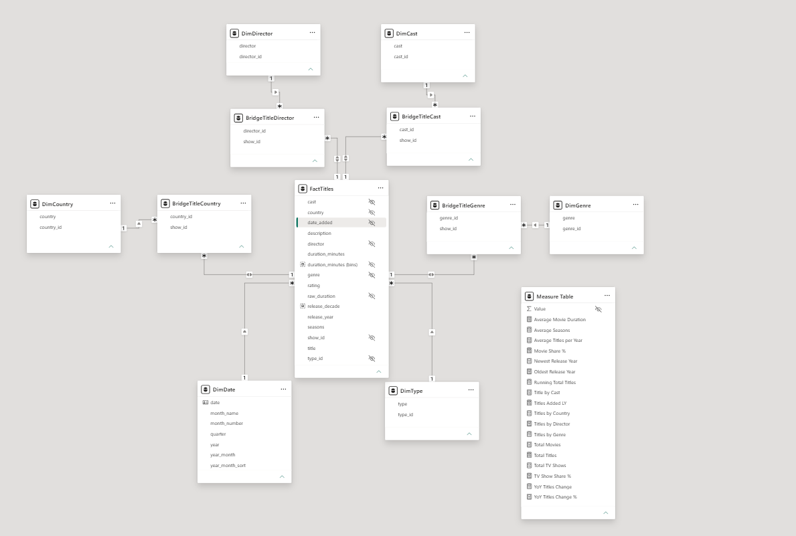
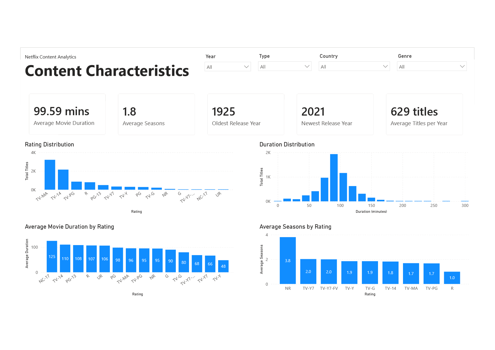
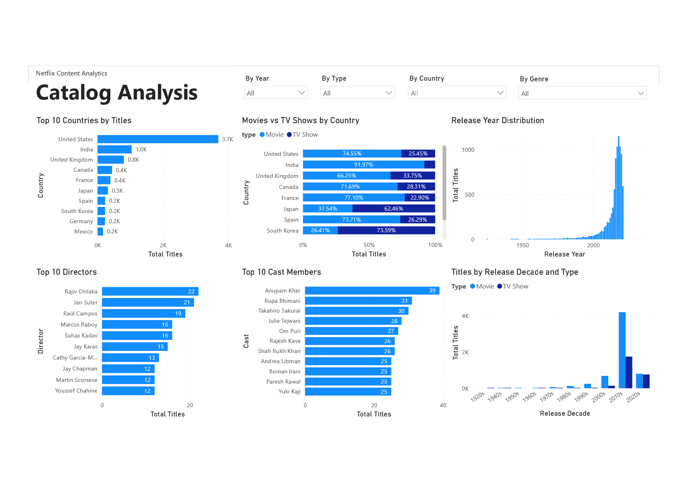

# Netflix Content Analytics

## Project Overview

This project explores the Netflix content catalog using Power BI.

The objective was to analyze the composition of the Netflix catalog, identify content trends, and build an interactive business intelligence dashboard providing insights into movies, TV shows, countries, directors, cast members, content ratings, release history, and catalog growth.

The project covers the complete BI workflow, including data cleaning and transformation in Power Query, dimensional data modeling, DAX measure development, and interactive dashboard design.

## Business Objectives

The dashboard was designed to answer the following business questions:

- How has the Netflix catalog grown over time?
- What is the overall composition of the Netflix catalog?
- Which countries contribute the most Movies and TV Shows?
- What is the ratio of Movies versus TV Shows?
- How are movie durations distributed?
- What is the distribution of content ratings?
- Which directors have the largest number of titles?
- Which cast members appear most frequently in the Netflix catalog?
- How has the composition of released content changed over the decades?

## Dataset

This project uses the **Netflix Movies and TV Shows** dataset created by **Shivam Bansal** and published on Kaggle.

The dataset contains metadata about movies and TV shows available on Netflix, including titles, release year, date added, countries, directors, cast members, content ratings, durations, genres, and descriptions.

### Dataset Characteristics

- Approximately 8,800 titles
- Movies and TV Shows
- Metadata only
- Data available through September 2021

**Source:** [Netflix Movies and TV Shows Dataset – Kaggle](https://www.kaggle.com/datasets/shivamb/netflix-shows)

## Data Preparation

The original dataset required several transformation and modeling steps before analysis.

The preparation process included:

- Cleaning and transforming raw data in Power Query
- Converting and validating date fields
- Creating a dedicated Date dimension
- Normalizing multi-value columns into bridge tables
- Building dimension tables for analytical reporting
- Designing a star schema with many-to-many relationships where appropriate
- Identifying and correcting data quality issues
- Validating the data model before visualization

Special attention was given to normalizing multi-value attributes (Countries, Genres, Directors, and Cast Members) by implementing bridge tables. This approach supports flexible filtering while maintaining a clean and scalable dimensional model.

## Data Model

The original dataset was transformed into a dimensional model following star schema principles to improve performance, maintainability, and analytical flexibility.

The final model consists of:

- One central fact table representing Netflix titles
- Multiple dimension tables containing descriptive attributes
- A dedicated Date dimension for time intelligence
- Bridge tables used to normalize multi-value attributes and support many-to-many relationships

This design enables efficient filtering, reusable DAX measures, and scalable analytical reporting.

The model follows dimensional modeling best practices by separating content records from descriptive attributes.

## Dashboard Pages

### Executive Overview

The Executive Overview provides a high-level view of the Netflix catalog.

It summarizes the total number of titles, the composition of Movies and TV Shows, catalog growth over time, and the main content categories and countries.

### Content Characteristics

The Content Characteristics page focuses on the attributes of Netflix content.

It analyzes content ratings, movie durations, and the average number of seasons for TV Shows, providing a more detailed view of the characteristics of the catalog.

### Catalog Analysis

The Catalog Analysis page provides a more detailed breakdown of the Netflix catalog by country, release year, directors, cast members, and content type.

It also examines how the composition of Movies and TV Shows has changed across release decades.

## DAX Highlights

The project uses DAX measures to support interactive analysis and time-based reporting.

Key calculations include:

- Total titles and content-type counts
- Movie and TV Show share percentages
- Average movie duration
- Average number of TV Show seasons
- Running totals
- Previous-year comparisons
- Year-over-year title growth
- Time-intelligence calculations using a dedicated Date dimension

## Key Insights

The analysis highlights several characteristics of the Netflix catalog:

- Movies represent the majority of titles in the dataset, while TV Shows make up a smaller share.
- The number of titles added to Netflix increased significantly over the analyzed period, particularly during the later years.
- The United States and India are among the countries contributing the largest number of titles.
- The majority of movies fall within a relatively concentrated range of durations.
- Content ratings are distributed across a wide range of audience categories, with several ratings accounting for a substantial share of the catalog.
- The distribution of Movies and TV Shows varies considerably across countries and release decades.

## Data Quality Challenges

Several data quality issues were identified and addressed during the preparation process.

These included:

- Inconsistent or invalid rating values
- An invalid country value that required correction
- Missing date values
- Multi-value fields stored as comma-separated text
- Incomplete date coverage in the source dataset

These issues were handled during the Power Query transformation process before the data was used for analysis.

## Skills Demonstrated

- Power BI
- Power Query
- DAX
- Data Cleaning and Transformation
- Dimensional Data Modeling
- Star Schema Design
- Many-to-Many Relationships
- Bridge Tables
- Time Intelligence
- Data Visualization
- Business Intelligence

## Future Improvements

Potential future improvements include:

- Updating the analysis with a more recent dataset
- Incorporating additional engagement or popularity data
- Expanding the geographic analysis
- Automating data refresh and deployment through Power BI Service
- Adding further analytical dimensions and KPIs
